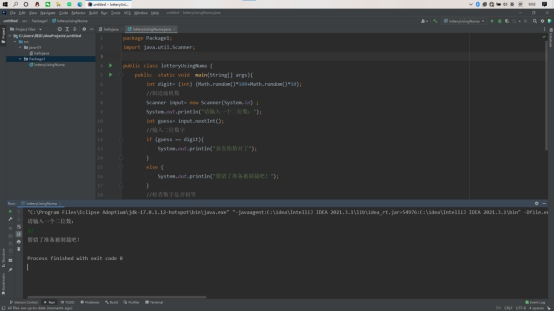

# 我的Java旅游

**2022年2月26日**

<figure><figcaption></figcaption></figure>

第一次写出来的程序，跟学习C语言的时候一摸一样，哈哈哈

<figure><figcaption></figcaption></figure>

我一口气写了两个，发现了自己在阅读中还是有很多地方不足，面对一些格式都有些忽略

<figure><figcaption></figcaption></figure>

**2022年3月3日**

因为想快点学会，得把简单的星题给做了，同时还给run设置了快捷键，之后就可以快点写代码了。

前几天打算写一个游戏，然后和SHU一起买了一个桌子，在b站学了一些教程，准备动手做一个像素类的生存游戏，我知道过程很艰辛，但是极大地提高了我的算法能力和实践能力，希望之后会有更好的发展。

舒：大家好，我叫shu，我之后的话会用粉色字体表示，我很荣幸能够参与这份“巨作”的制作，期待我的发挥。

我就知道他要选粉色，之前拿网球拍的时候总要挑一个偏女性化的颜色，然后问我要哪个。话说回来，前几天一直在用Aseprite画像素图，给大家展示一下。

我们的游戏叫做For Help，类似于荒岛求生那种。

**2022年3月11日**

<figure><figcaption></figcaption></figure>

这是我画的标题，踩了好多坑，然后两天之内用得比较熟练了，太棒了！

**2022年3月14日**

我们重写了代码，初始代码比较low，我们更改了代码的写法，经过两次的修整，我们确定了最后的写法，便于之后写更多的东西！这是一个激动人心的时刻，我们花了5天！已经看到未来的出路了，加油干！为了之后进实验室也是为了让我们不断的更新自己的知识和对Java的热情！

早上写好了双重缓存，然后又遇到了很多问题，最后还是解决了，今天实现了双重缓存和界面切换以及控制图标移动，晚上赶一波地图。

**2022年3月15日**

准确来说是3/15，这是3/16的凌晨，以前总害怕晚上12点，什么梳头会怎么怎么样，好像长大之后就不会在考虑这些事情了，我们写了人物的移动，很快，但是之中还有一些bug，经过不断修改最后流畅地让人物在地图里面移动了！，期待一个月之后的样子！会不会我们的天气就已经做出来了，我挺期待阴天和暴雨天的，我一定要多练稿子！！

**2022年3月16日**

我们在想方设法的在这个游戏添加一些元素，准备在这个周实现生成树，UI界面，以及材料的收集，会比较难弄，但是全部完成之后，我们会停止对这个游戏的更新。学习C#之后才会更新这个游戏，相比较Unity更好写出我们所需要的功能。

舒：今天第一次自己写入了一些代码，实现弹窗的功能，浅坐了两个小时，虽然有点累，但是代码跑起来过后心情还是很澎湃，这就是代码的魅力。

**2022年3月24日**

今天是3月24日，我们在写完一些功能后决定先学习，但是我一直不在状态。很难学习进去，我准备一直修改我们的代码，我会重新策划我们的游戏并非简单的生存。

我前段时间重写了我们的代码，细化了很多东西，也重画了地图和人物实现了人物帧数变化，希望我这个游戏可以越来越好，学到后面，其实最大的问题是学得很杂，什么都想学，结果一团糟。我会尽量合理地规划自己的学习路径。

**2022年9月13日**

今天是22年9月13日，我决定开始自学后端，其实前端也只是了解了一点点，但是想着快一些进入Web开发阶段，开始学习servlet，课程随便听听就好了，之后通过课程可以再把前端的框架学习一下，就这样吧，因为是Java之旅，我就没写过多的关于前端的，还有实验室的东西，之后再说。

**2022年11月30日**

今天是22年11月30日，早在前几天我已经打算开始转c++了，很令人沮丧的消息，游戏仍然在我的电脑里，什么时候想着要完成，那就自己完成吧，我已经搬出宿舍了，舒耀鑫还在宿舍，我们很少联系了。我打算主攻算法，就这样吧，我的Java之旅再见了。
